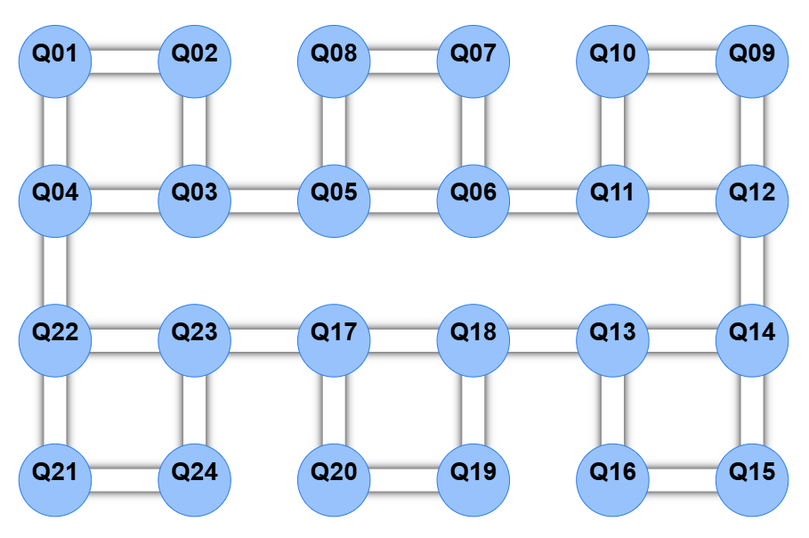

# Hardware-efficient, UCCSD-inspired ansätze with native cross-chip RZX

Proposal / exploration notes. Goal: design circuits that reach the accuracy of our
reduced-doubles UCCSD (HF / Cl2 / Br2 pipelines) with **far fewer two-qubit gates**,
by treating the continuous-angle cross-chip `RZX(θ)` as a *first-class native gate*
instead of something CZs get decomposed into.

---

## 1. Setting

### 1.1 Hardware



- Four chips of 4 qubits each (2×2 squares): {1,2,3,4}, {5,6,7,8}, {9,10,11,12}, {13,14,15,16}.
- Three **cross-chip links**: 4–5 (top row), 7–9 (bottom row), 11–13 (top row).
  Note they alternate top / bottom / top.
- On the cross-chip links the native two-qubit gate is `RZX(θ) = exp(-i θ/2 · Z⊗X)`
  with a **continuous angle**. This is unusual: most platforms only expose fixed
  entanglers, so a θ-dependent two-qubit interaction normally costs *two* fixed
  gates (`CZ · RX(θ) · CZ`). Here the parameterized interaction can cost **one**
  native gate. Whether a smaller angle means a shorter or less noisy pulse is a
  hardware-calibration question, not something established by the current
  simulations: `GateArityDepolarizingNoise` currently assigns the same error
  probability to every two-qubit gate regardless of angle.

### 1.2 What we already have (baseline to beat)

`improved create UCCSD circuit .py` compiles each double as a CZ/H hub-ladder around
one `RX(θ)` pivot, with hub continuity + peephole cancellation, then
`fuse_cz_rot_cz_to_rzx` fuses the innermost `CZ · RX(θ) · CZ` into one `RZX(θ)`.
Current saved circuits (`June_main/circuits2read/`):

| circuit | qubits | doubles | CZ | param. RZX |
|---|---|---|---|---|
| HF_8q_3doubles_rzx | 8 | 3 | 20 | 3 |
| Cl2_10q_3doubles_rzx | 10 | 3 | 28 | 3 |
| Br2_12q_4doubles_rzx | 12 | 4 | 36 | 4 |

### 1.3 The physics we can exploit

From `UCCSD_Mole/HF.ipynb` (and the Cl2/Br2 analogues):

- The reduced-ansatz convergence scan shows **one paired HOMO→LUMO double already
  captures most of the correlation**. For HF at 1.4 Å, the notebook reports about
  1.594, 1.249, and 0.944 mHa error for one, two, and three selected double
  parameters, respectively. This motivates a small ansatz; it does not prove that
  one double is always sufficient at every geometry or for every molecule.
- The selected determinant subspace is small, so direct sparse-state methods are
  worth testing. The actual FCI sparsity and overlap must be measured before using
  it as an assumption.
- All selected doubles share the same creation pair `(N/2−1, N−1)`
  (e.g. Br2: `a5† a11† aj ai`), i.e. they all promote into the same LUMO pair.

### 1.4 Three ansätze that must not be conflated

The current work contains three related but different objects:

1. **Fermionic reduced UCC:** products of
   `exp[θ(T_i - T_i†)]`, as optimized by TenCirChem.
2. **Two-string qubit excitation (`pair=True`):** two Pauli rotations with a
   shared parameter. This is number-conserving on the intended subspace.
3. **Single odd-Y representative (`pair=False`, current default):** one Pauli
   rotation per selected double. It is cheap and agrees with the intended
   excitation for a single action on the reference determinant, but it is not the
   same multi-parameter unitary and can leak out of the fixed-electron-number
   sector.

Every experiment below must name which of these is its reference. “Same as UCCSD”
may only be claimed after an explicit statevector or energy comparison.

So the true question is not "how do we compile UCCSD cheaply" but
**"what is the cheapest native-gate circuit whose image contains this sparse,
number-conserving manifold?"** Several directions below attack this.

---

## 2. Idea A — Pivot-on-the-link compilation (lowest risk, extends current code)

**Hypothesis:** hardware-aware placement can put the θ-carrying fused RZX on a
useful physical bridge and reduce the remaining cross-chip routing cost.

- The fused `RZX(θ)` always sits on the (pivot, β-hub) pair of the ladder. Today the
  pivot is chosen by `hub0` / midpoint heuristics with no knowledge of the chip graph.
- Change `_compile_tworow` to take the hardware edge list and pick
  `(pivot, hub_b)` to be a **cross-chip edge** whenever the string's support spans
  chips (it always does, since the shared creation pair (N/2−1, N−1) sits on the last
  chip while the annihilated orbitals walk across the others).
- Then re-route the CZ fan-in chains along actual graph paths (currently they assume
  a line `q, q+1`; the real graph is 2×2 squares chained by single links, so the
  compiler must build a graph-valid parity tree).
- **Placement co-design:** the mapping `spin orbital → physical qubit` is a free
  discrete variable (8! per row, but heavily constrained). Search it (brute force /
  annealing, tiny space) to minimize (i) number of cross-chip CZs in the Clifford
  ladders, and (ii) total CZ count after the peephole pass. The alternating
  top/bottom cross links matter here: chip0↔chip1 and chip2↔chip3 talk through the
  α row, chip1↔chip2 through the β row, so the α/β assignment per chip is itself a
  choice.

**Important lower bound:** if one Pauli support spans several chips, every graph cut
separating part of that support must be crossed. Fusing one
`CZ · RX(θ) · CZ` sandwich removes two gates on one edge, but cannot remove parity
routing across all other chip boundaries. Therefore “exactly one cross-chip gate
per double” is generally impossible for long strings. The deliverable is instead:

- preserve the chosen reference unitary exactly;
- minimize cross-chip two-qubit gates subject to the physical graph;
- report the minimum Steiner-tree/cut lower bound and the achieved count;
- place parameterized RZX gates on bridges when this improves the total cost.

## 3. Idea B — Compile the *set* of doubles jointly (shared-Clifford diagonalization)

Today each double pays its own ladder up/down; hub continuity only cancels the shared
subtree between *adjacent* blocks. Stronger idea:

- The selected odd-Y Pauli representatives for HF, Cl2, and Br2 have been checked
  and **mutually commute**. This follows from an even symplectic anticommutation
  count, not merely from overlap on the shared creation pair; their Jordan–Wigner
  Z tails overlap elsewhere.
- If yes, there is a single Clifford `C` that diagonalizes all k strings at once:
  the circuit becomes `C† · [RZ(θ₁) … RZ(θk) in parallel] · C`.
  The Clifford cost is paid **once**, not once per double, and the k rotations run
  in parallel → depth ~independent of k.
- Synthesize `C` under the chip graph (this is a small stabilizer-tableau problem;
  qiskit's `Clifford` synthesis or hand construction from the shared ladder).
- If the strings don't all commute, partition into commuting layers and do this per
  layer.

This is a **commuting-Pauli ansatz**, not an exact compilation of the full
fermionic reduced-UCC generators. The corresponding fermionic generators generally
do not commute. Gate reduction is a hypothesis to benchmark; no fixed CZ target is
assumed before graph-constrained synthesis.

## 4. Idea C — Sparse-determinant state preparation (drop UCC form entirely)

Since the target is a superposition of ~k determinants, prepare it *directly*,
Givens-style — this generalizes the paper's Eq. (6)–(8) multireference prep that we
already implement (`initial_state_circuit`: one `Ry(β)` + 3 CX for |HF⟩ − β|D₁⟩).

- A superposition `c₀|HF⟩ + Σᵢ cᵢ|Dᵢ⟩` over k paired-double determinants costs a
  **cascade of k controlled/Givens rotations**, each followed by a CX fan-out that
  moves the excited pair into place. Each determinant differs from |HF⟩ by moving
  2 electrons into the same LUMO pair — the fan-outs largely overlap, so the CX
  cost is shared.
- Parameters = the k amplitudes, optimized variationally like the θs now. For the
  special set of real, paired excitations with one shared virtual pair and distinct
  occupied pairs, the exact fermionic rotations stay in
  `span{|HF⟩, |D₁⟩, …, |Dk⟩}` and provide hyperspherical coordinates for real
  states in that subspace. Under these conditions, direct real-amplitude
  preparation can have the same variational floor as the exact reduced fermionic
  ansatz.
- This does **not** follow from `pair=False`. The single-Pauli approximation may
  leave the electron-number sector when several rotations are composed. Compare
  direct preparation separately with fermionic UCC, `pair=True`, and `pair=False`.
- Route the CX/Givens ladders along the chip graph; the rotation that crosses chips
  becomes a native RZX pair (a Givens rotation = 2 RZX + single-qubit Cliffords).

**Expected win:** roughly one entangling "rung" per determinant; plausibly the
cheapest circuit that can hit FCI in these CAS spaces. First experiment: HF (8q),
k=2 — count gates and check statevector overlap with the FCI vector from tencirchem.

## 5. Idea D — Native-pool adaptive ansatz (most exploratory)

Flip the direction: instead of compiling chemistry operators into gates, grow a
circuit from a pool of gates the hardware likes, and let symmetry constraints do the
chemistry.

- **Pool:** begin with number-conserving operators. A pool containing only raw
  `RZX`, `RX`, and similar number-changing generators can have zero ADAPT gradient
  at a fixed-particle-number Hartree–Fock state because the Hamiltonian preserves
  particle number. A penalty term does not repair this zero first-step gradient.
  The primary pool should therefore use the number-conserving
  composite: Givens/exchange rotation `exp(-iθ(XX+YY)/4)` on an edge
  (= 2 locally transformed RZX gates) and paired-double composites from Idea C.
- **Growth rule:** ADAPT-VQE gradient selection (⟨[H, A]⟩ per pool element), so the
  circuit stays as short as the physics allows — the HF.ipynb result says it should
  stop after very few layers.
- **Symmetry experiment:** after a number-conserving seed, optionally compare raw
  RZX plus `λ⟨(N̂−N)²⟩` against a strictly conserving pool. Record particle-number
  leakage. Postselection and a finite penalty are different methods and must be
  benchmarked separately.

**Expected win:** unknown — that's the point. It gives a data-driven lower bound on
"how much entanglement does this molecule actually need on this graph".

## 6. Idea E — Paired (hard-core boson) encoding, 1 qubit per spatial orbital

All dominant doubles are *paired* (kα,kβ → aα,aβ). In the HCB encoding a spatial
orbital is one qubit and a paired double becomes a plain **2-qubit Givens rotation**
— no JW Z-strings at all.

- Br2's (10,6) CAS → 6 qubits instead of 12; the whole ansatz is k Givens rotations
  before routing. Each local Givens is two RZX-equivalents; non-neighbor pair
  rotations may still require SWAP or parity-routing overhead.
- Cost: the pUCCD energy floor is above full UCCSD (no unpaired excitations). Two
  mitigations: (i) our own scans show the paired doubles dominate, so the gap may be
  below the noise floor anyway; (ii) use the freed qubits to *enlarge the active
  space* (16 physical qubits → up to 16 spatial orbitals in this encoding). A
  larger pUCCD active space is not guaranteed to beat small-CAS UCCSD, so this is
  an empirical comparison rather than a promised improvement.

## 7. Idea F — Squeeze the parameter/measurement side (orthogonal, cheap)

- If one parameter appears once in a Pauli rotation, then
  `E(θ) = A cos θ + B sin θ + C`, so **three-point Rotosolve** is exact for that
  coordinate in the noiseless case. Shared parameters (`pair=True`), repeated
  gates, CDR, and finite-shot estimates can produce higher harmonics or noisy
  deviations; detect the harmonic order before choosing the number of samples.
- Initialize from MP2 amplitudes and record optimized angle sizes. Do not claim a
  small-angle hardware advantage unless pulse duration/error calibration is
  available; the current depolarizing model is angle-independent. Combine with CDR
  pipeline (`June_main/export2cloud/main_Br2.py`) which already parameterizes RZX
  with sympy symbols.

---

## 8. Evaluation protocol (common to all ideas)

1. **Exactness / floor:** statevector energy vs active-space FCI (tencirchem, as in
   the notebooks). Target: within 1.6 mHa, same as the current reduced-doubles scans.
2. **Cost metrics:** total 2Q gates, **cross-chip 2Q gates** (the expensive ones),
   circuit depth, parameter count. Baseline = table in §1.2.
3. **Noise:** the existing June_main Cirq pipeline with higher depolarizing on
   cross-chip gates; compare energy-after-CDR across ansätze at matched shot budget.
4. **Robustness:** repeat over the bond-length grid (the doubles are fixed once at
   the reference geometry, as in the notebooks) — a good ansatz should not need
   re-selection along the curve.

## 9. Suggested order of attack

| priority | idea | risk | expected payoff |
|---|---|---|---|
| 1 | A: graph-aware placement and routing | low–medium | approach the graph-cut lower bound while preserving the reference unitary |
| 2 | B: joint diagonalization of the doubles set | medium | amortize Clifford cost and expose parallel rotations |
| 3 | C: sparse-determinant state preparation | medium | test a potentially much smaller state-preparation circuit |
| 4 | E: HCB / pUCCD encoding | medium | halves qubits or doubles active space |
| 5 | D: adaptive native-pool ansatz | high | data-driven "how cheap can it get" |
| — | F: Rotosolve and MP2 initialization | low | optimizer overlay for compatible ansätze |

Ideas A→B→C form a natural sequence because each reuses the verification machinery
(`_verify_program`, statevector checks) already in the repo. Only Idea A is intended
to preserve the chosen unitary exactly. Ideas B and C must be evaluated as alternative
ansätze and may trade expressivity for lower hardware cost.

---

## 10. Isolation rule for all exploration code

The existing source code and generated circuits are references and must remain
unchanged. All new implementation, tests, generated circuits, and result files go
under a new top-level `exploring/` directory.

Proposed layout:

```text
exploring/
├── README.md
├── common/
│   ├── connectivity.py
│   ├── cases.py
│   ├── circuit_metrics.py
│   ├── statevector_checks.py
│   └── chemistry_reference.py
├── idea_a_graph_compile/
│   ├── graph_compiler.py
│   ├── placement_search.py
│   └── run.py
├── idea_b_joint_clifford/
│   ├── joint_diagonalization.py
│   └── run.py
├── idea_c_determinant_prep/
│   ├── sparse_state_prep.py
│   └── run.py
├── idea_d_adapt/
│   ├── operator_pool.py
│   ├── adapt_driver.py
│   └── run.py
├── idea_e_hcb/
│   ├── hcb_mapping.py
│   ├── puccd_ansatz.py
│   └── run.py
├── idea_f_rotosolve/
│   ├── rotosolve.py
│   └── run.py
├── tests/
└── results/
```

This is a target organization, not a requirement to create every file before its
experiment starts. Build the shared baseline first, then add one idea at a time.
Existing functions may be loaded read-only for comparison. If a private helper is
needed experimentally, copy the minimum logic into `exploring/` and document its
source rather than modifying production code.

## 11. Shared foundation to implement first

### 11.1 Canonical physical connectivity

`exploring/common/connectivity.py` should be the only source of physical topology.
The diagram uses 1-based labels, while Qiskit/Cirq use 0-based indices:

```python
CROSS_CHIP_EDGES = {(3, 4), (6, 8), (10, 12)}  # 0-based
```

Add all four edges of each 2×2 chip and normalize every edge as
`(min(q0, q1), max(q0, q1))`. Define:

- `physical_graph()` — adjacency map for all 16 physical qubits;
- `chip_of_physical(q)` — physical chip index;
- `is_cross_chip_edge(q0, q1)`;
- `validate_circuit_edges(circuit, placement)` — fail on an invalid two-qubit edge;
- `logical_to_physical` and inverse-map validators.

Do not reuse `uccsd_circuit_io.chip_of` as the physical definition. It describes a
logical grouping and currently disagrees with both the image and manually selected
noise tags. Each benchmark must store the placement used.

For 8-, 10-, and 12-qubit molecules, unused physical qubits are allowed. A placement
is an injection from logical qubits into the full 16-qubit graph, not a renumbering
of a smaller line graph.

### 11.2 Fixed molecule registry

`exploring/common/cases.py` should record:

- HF: 8 logical qubits, 6 electrons, 3 selected doubles;
- Cl2: 10 logical qubits, 8 electrons, 3 selected doubles;
- Br2: 12 logical qubits, 10 electrons, 4 selected doubles;
- reference bond length, bond grid, Hamiltonian path, existing baseline JSON, and
  fixed double list for each case.

Read the values from the existing notebooks/JSON once and freeze them in this
exploration registry. Do not re-rank doubles at each bond length.

### 11.3 Common metrics

`exploring/common/circuit_metrics.py` should return one record per circuit:

- total gates and total two-qubit gates;
- CZ and RZX counts separately;
- cross-chip two-qubit count after applying the placement;
- total depth and two-qubit depth;
- number of independent parameters;
- number and total length of routing/SWAP operations;
- parameterized-RZX count and fixed-angle-RZX count.

Report both **total RZX count** and **cross-chip RZX count**. A lower RZX count is
not automatically better if it is replaced by more CZ/SWAP gates.

### 11.4 Common correctness checks

`exploring/common/statevector_checks.py` should provide:

- equality up to global phase;
- random-input unitary/action comparison for exact compilers;
- overlap between candidate and reference states;
- expected particle number and
  `leakage = 1 - probability(Hamming weight = n_electrons)`;
- variational energy from the existing Pauli Hamiltonian;
- consistent conversion among Qiskit little-endian, Cirq ordering, and TenCirChem
  bitstrings.

All bit-order conversions need one explicit basis-state test before chemistry tests
are trusted.

### 11.5 Baseline command

The first runnable script should read the three existing `*_rzx.json` files without
changing them and write `exploring/results/baseline_metrics.json`. It should also
reproduce the known logical counts:

- HF: 20 CZ and 3 parameterized RZX;
- Cl2: 28 CZ and 3 parameterized RZX;
- Br2: 36 CZ and 4 parameterized RZX.

Physical cross-chip counts are not meaningful until a placement is supplied; the
script should say “unplaced” rather than infer them from logical qubit numbers.

## 12. Idea A implementation — graph-aware exact compilation

### 12.1 Objective

Preserve one explicitly chosen reference circuit (`pair=False` first, then
`pair=True`) while minimizing physical two-qubit cost. This is the control
experiment: any energy difference indicates a compiler bug.

### 12.2 Algorithm

1. Generate each Pauli support using the existing double definitions.
2. For a candidate logical-to-physical placement, compute a minimum Steiner tree
   connecting each support on the 16-qubit graph. With only 16 vertices, enumerate
   subsets of optional Steiner vertices or use a dynamic-programming Steiner
   solver; do not rely only on shortest paths selected independently.
3. Choose a pivot and orient the tree so that conjugating a single-qubit Pauli at
   the root produces the desired string. Add local basis changes for X/Y/Z.
4. Emit the tree parity network, the parameterized root rotation, and the inverse
   network. Search for a root/tree where a `CZ · RX · CZ` pair can be fused into a
   graph-valid `RZX(other, RX_qubit)`.
5. Concatenate all doubles, then cancel inverse Cliffords across adjacent blocks.
   Search double ordering jointly with placement because cancellation depends on
   both.
6. Score candidates lexicographically:
   `(cross_chip_2q, two_qubit_depth, total_2q, total_depth)`.
7. Use exhaustive search only for constrained placements (for example, preserve
   spin pairs or chip assignments). Use branch-and-bound or simulated annealing
   for the full injection problem, with deterministic seeds.

### 12.3 Lower bound

For every Pauli support, record:

- number of chip cuts that separate its support;
- cross-chip edges in a minimum Steiner tree;
- the minimum number of times each bridge must be traversed by the chosen parity
  construction.

Compare the compiled result to this lower bound. The scientific result is the gap
to the bound, not an assumed one-RZX target.

### 12.4 Tests

- Every emitted two-qubit gate lies on a physical edge.
- Symbolic Pauli-frame verification reproduces the intended string and sign.
- At 5–10 random angle vectors, candidate and logical reference statevectors agree
  up to global phase from both HF and random initial states.
- RZX orientation is tested independently:
  `CZ(a,b) RX(q,θ) CZ(a,b) = RZX(other,q,θ)`.
- The compiler is deterministic for a fixed search seed.
- Candidate counts do not exceed the baseline unless the report clearly explains a
  trade for fewer cross-chip gates or lower depth.

### 12.5 Stop/go criterion

Continue if at least one molecule reduces the lexicographic physical cost while
preserving the reference action. Stop adding placement-search complexity if three
search strategies reach the same lower bound or if runtime grows without reducing
the gap.

## 13. Idea B implementation — joint Clifford for commuting Paulis

### 13.1 Objective

Implement the product of the selected **single-Pauli** rotations using one shared
Clifford frame. This evaluates a new compilation of the commuting-Pauli ansatz, not
full fermionic UCC.

### 13.2 Algorithm

1. Encode each Pauli string as a binary symplectic vector `(x | z)`.
2. Build the commutation matrix using
   `x_i·z_j + z_i·x_j mod 2`; assert it is zero for the selected HF/Cl2/Br2 sets.
3. Row-reduce the independent generators. Record dependencies so parameter
   combinations remain correct.
4. Synthesize a Clifford tableau that maps the generators to Z-type operators.
   First test unconstrained Qiskit Clifford synthesis as an oracle.
5. Route/synthesize the Clifford on the physical graph and optimize its placement.
6. Emit all diagonal rotations in the common frame. Parallelize only rotations
   whose physical supports and decomposition permit it; commutation alone does not
   guarantee zero hardware conflict.
7. Apply the inverse Clifford.

### 13.3 Tests

- Symplectic commutation and generator rank match an independently computed matrix.
- Conjugation by the synthesized Clifford maps every input Pauli to its recorded
  diagonal Pauli with the correct sign.
- Candidate unitary equals the direct product of Pauli exponentials at random
  angles to `1e-9` statevector tolerance.
- Compare gate count/depth with both the existing sequential circuit and Idea A.
- Compare optimized energy and electron-number leakage with `pair=False`; they
  should match because the unitary is the same.
- Separately demonstrate that fermionic excitation generators do not generally
  commute, preventing an accidental claim of full-UCC equivalence.

### 13.4 Stop/go criterion

Keep the method if shared-frame synthesis reduces total two-qubit gates or
two-qubit depth for at least two molecules after physical routing. If routing erases
the logical saving, retain the result as evidence and test smaller commuting groups.

## 14. Idea C implementation — direct sparse determinant preparation

### 14.1 Objective

Prepare
`c0|HF⟩ + c1|D1⟩ + ... + ck|Dk⟩`
directly, using the same selected paired determinants as the chemistry notebooks.

### 14.2 Parameterization

Use normalized real hyperspherical coordinates:

```text
c0 = cos(a1)
c1 = sin(a1) cos(a2)
c2 = sin(a1) sin(a2) cos(a3)
...
ck = sin(a1) ... sin(ak)
```

This uses exactly `k` angles and automatically normalizes the state. For real
molecular Hamiltonians, real coefficients are a suitable first experiment.

### 14.3 Two implementation paths

1. **Correctness oracle:** construct a generic isometry/state-preparation circuit
   for the sparse amplitude vector. It may be gate-expensive, but verifies energies
   and the determinant manifold.
2. **Structured circuit:** generalize the existing two-determinant
   multireference preparation. Use a sequence of controlled pair moves sharing the
   LUMO target and cancel common fan-out/fan-in operations. Decompose each local
   pair exchange into graph-valid RZX plus one-qubit Cliffords.

Optimize the structured circuit only after it agrees with the oracle for random
coefficient vectors.

### 14.4 Comparisons

At the same determinant set, optimize and compare:

- exact fermionic reduced UCC from TenCirChem;
- `pair=True`;
- `pair=False`;
- direct sparse preparation.

Record minimum energy, FCI overlap, selected-subspace probability, particle-number
leakage, and physical gate metrics. “Same variational floor” is accepted only if the
optimized energies agree to `1e-6 Ha` and random target states in the determinant
subspace can be reproduced.

### 14.5 Tests and stop/go criterion

- Prepared basis support contains only HF and the selected determinants.
- Normalization error is below `1e-12`; leakage is below `1e-10` noiselessly.
- Structured and oracle statevectors agree up to global phase.
- Start with HF at `k=1`, then `k=2`, then all three; continue to Cl2/Br2 only after
  correctness and a two-qubit saving appear.
- Keep the method if it matches or improves the reference energy while reducing
  total two-qubit count or depth. Otherwise report the expressivity/cost boundary.

## 15. Idea D implementation — symmetry-preserving ADAPT

### 15.1 Operator pools

Implement two named pools:

- **Conserving pool:** nearest-neighbor exchange/Givens generators and structured
  paired-double generators, all preserving particle number.
- **Hybrid pool:** the conserving pool plus raw edge-RZX and local rotations after
  at least one conserving operator has been selected.

Do not start raw-RZX ADAPT from HF and interpret zero gradients as a negative
result; that can be a symmetry selection rule.

### 15.2 ADAPT loop

1. Prepare HF or the chosen multireference state.
2. Evaluate `|⟨ψ|[H,A_j]|ψ⟩|` for each pool generator.
3. Add the largest-gradient generator if it exceeds a fixed threshold.
4. Re-optimize all active parameters.
5. Stop on energy change, gradient norm, maximum depth, or maximum cross-chip gate
   budget.
6. Log every selected operator, gradient, energy, leakage, and physical cost.

Use exact statevector gradients first. Add shot noise only after deterministic
selection is stable.

### 15.3 Tests and stop/go criterion

- Finite-difference gradients agree with commutator gradients.
- Conserving operators have zero noiseless particle-number leakage.
- A deliberately number-changing operator has the expected zero HF gradient.
- The same seed and tie-breaking rule produce the same selected sequence.
- Continue beyond HF only if ADAPT reaches 1.6 mHa with a lower physical cost than
  Ideas A–C. Otherwise it remains a documented exploratory result.

## 16. Idea E implementation — HCB/pUCCD

### 16.1 Mapping

Within the seniority-zero sector, map each spatial orbital occupation pair to one
qubit:

```text
empty orbital pair    -> |0>
doubly occupied pair  -> |1>
b†_p b_q + b†_q b_p   -> (X_p X_q + Y_p Y_q) / 2
```

This removes Jordan–Wigner parity strings but excludes broken-pair states and
ordinary singles.

### 16.2 Algorithm

1. Build the seniority-zero Hamiltonian independently and verify its matrix against
   the corresponding block of the fermionic Hamiltonian for a tiny test case.
2. Prepare the paired HF bitstring.
3. Add selected pair-hopping/Givens rotations.
4. Place the reduced number of logical qubits on a connected low-cost subgraph.
5. Decompose each adjacent Givens into two locally transformed RZX gates; route
   nonadjacent interactions explicitly.
6. Optimize energy for the original active spaces first.
7. Only then test whether freed qubits permit a larger active space with a better
   accuracy/cost trade.

### 16.3 Tests and stop/go criterion

- HCB Hamiltonian matrix equals the seniority-zero fermionic block.
- Particle-pair number is conserved.
- One Givens rotation matches the analytic 2×2 rotation in the one-pair subspace.
- Report `E_pUCCD - E_FCI` rather than imposing chemical accuracy in advance.
- Continue to enlarged active spaces only if small-space pUCCD is competitive or
  the added orbitals recover more correlation than the seniority restriction loses.

## 17. Idea F implementation — Rotosolve overlay

### 17.1 Harmonic detection

For each parameter, sample a dense noiseless coordinate slice and fit:

```text
E(θ) = c0 + Σ_m [a_m cos(mθ) + b_m sin(mθ)]
```

Use three-point Rotosolve only when the first harmonic explains the slice to the
chosen tolerance. Otherwise use generalized Rotosolve with enough samples for the
observed harmonic order.

### 17.2 Optimizer

1. Initialize with zero and MP2 amplitudes in separate runs.
2. Sweep coordinates, solve each one-dimensional trigonometric minimum, and stop on
   energy change/maximum sweeps.
3. Compare with the existing optimizer from identical initial points.
4. Under finite shots, repeat multiple seeds and report mean, standard deviation,
   evaluation count, and failure rate.
5. Apply CDR with a matched total shot/evaluation budget; do not compare methods at
   unequal measurement cost.

### 17.3 Tests and stop/go criterion

- On synthetic first-harmonic objectives, recover the analytic minimum.
- On `pair=False`, match a conventional noiseless optimizer within `1e-5 Ha`.
- Detect and handle higher harmonics for repeated/shared parameters.
- Treat small-angle pulse benefits as out of scope until hardware calibration or an
  angle-dependent noise model is supplied.
- Keep Rotosolve as the default overlay only if it reaches equal energy with fewer
  evaluations or lower variance at matched cost.

## 18. Benchmark matrix and result format

Every experiment writes a machine-readable JSON result under
`exploring/results/` with:

```text
molecule, bond_length, ansatz, reference_ansatz, placement, seed,
n_gates, n_2q, n_cz, n_rzx, n_cross_chip_2q,
depth, depth_2q, n_parameters,
energy, error_vs_fci_mHa, overlap_fci, particle_number_leakage,
optimizer_evaluations, shots, cdr_enabled, runtime_seconds
```

Run three tiers:

1. **Fast unit tests:** topology, Pauli algebra, RZX orientation, statevector
   equality, bit order, and metrics.
2. **Noiseless chemistry:** variational energy and overlap for HF, Cl2, Br2 at the
   reference geometry, then fixed-double bond scans.
3. **Noisy matched-budget tests:** existing Cirq/CDR model, repeated seeds, equal
   total shots and optimizer evaluations.

Use 1.6 mHa as the normal chemical-accuracy target, but always report the raw error.
For an exact compiler, also require agreement with its reference ansatz independent
of FCI accuracy.

## 19. Coding milestones

### Milestone 0 — baseline and layout audit

- Create only `exploring/common/`, `exploring/tests/`, and `exploring/results/`.
- Encode the physical graph and the three fixed molecule cases.
- Reproduce baseline logical gate counts and validate bit ordering.
- Document the disagreement among physical edges, logical `chip_of`, and manual
  simulation tags. Do not silently choose one.

**Exit condition:** all baseline tests pass and every physical metric is attached to
an explicit placement.

### Milestone 1 — Idea A

- Implement graph-valid parity trees and placement search.
- Establish lower bounds and exact statevector equivalence.

**Exit condition:** one exact candidate per molecule and a report of achieved cost
versus lower bound.

### Milestone 2 — Idea B

- Implement symplectic joint diagonalization and graph-constrained synthesis.

**Exit condition:** exact equivalence to the sequential commuting-Pauli ansatz and a
measured gate/depth comparison.

### Milestone 3 — Idea C

- Implement sparse-state oracle, then structured paired state preparation.

**Exit condition:** verified determinant support and energy/cost comparison against
fermionic UCC, `pair=True`, and `pair=False`.

### Milestone 4 — Idea E

- Implement and validate HCB mapping, then pUCCD circuits.

**Exit condition:** seniority-zero matrix check and quantified accuracy/cost trade.

### Milestone 5 — Idea D

- Implement exact-gradient conserving ADAPT, then optional hybrid pool.

**Exit condition:** reproducible operator sequence and Pareto comparison against
earlier ideas.

### Milestone 6 — Idea F and noisy comparison

- Add harmonic-aware Rotosolve to compatible candidates.
- Run matched-budget noisy/CDR tests only for the best noiseless circuits.

**Exit condition:** a final HF/Cl2/Br2 comparison showing energy accuracy, total
gate count, depth, and RZX/cross-chip cost.

## 20. Final selection rule

Do not choose one method from a single gate count. For each molecule, identify the
Pareto-optimal candidates: no other candidate may have both lower hardware cost and
equal-or-better energy. Prefer a systematic method that uses the same construction
for HF, Cl2, and Br2 over three separately hand-tuned circuits.

## Goal

**Explore options and discover a new systematic method for creating the three
molecular circuits we have—HF, Cl2, and Br2—with a lower total gate count, lower
circuit depth, or fewer RZX gates, while achieving the same or better energy
accuracy.**
