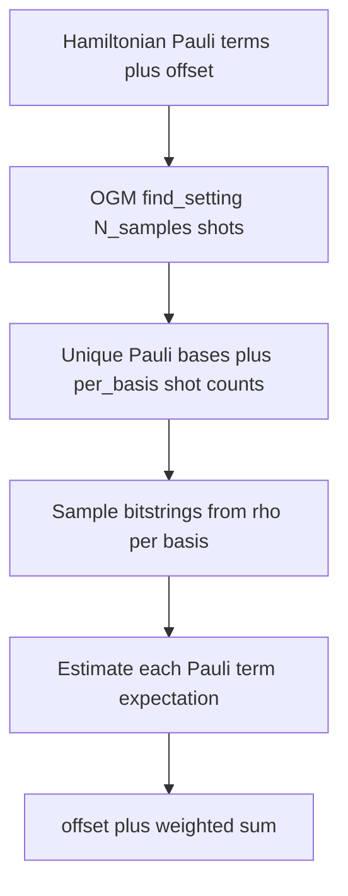

# OGM measure procedure

This document explains, for one worked example, **which Pauli measurement bases** the OGM path uses, **how many shots** are assigned to each basis, and **how those samples are turned into a single Hamiltonian energy estimate**. The behavior matches the implementation in `[shot_measurement.py](../shot_measurement.py)` (notably `estimate_energy_from_noisy_rho_shots`, `_load_shadowgrouping_scheme`, and `_unique_settings_with_counts`).

## Worked example (H4, bond 2.0, 56 VQE parameters, noiseless state)

We use the same setting as `[main_cursor.ipynb](../main_cursor.ipynb)` for the chemistry problem and parameter vector, but we simulate the **noiseless** pure state from the decomposed ansatz so the reference energy is exact and easy to compare.


| Quantity                | Value                                                                                                                                                           |
| ----------------------- | --------------------------------------------------------------------------------------------------------------------------------------------------------------- |
| Molecule / bond         | H4, bond length `2.0`                                                                                                                                           |
| Ansatz                  | `prepare_decomposed_ansatz_cirq(num_spatial=4, ansatz_layers=8)`                                                                                                |
| Parameters              | 56 numbers (the fixed `vqe_parameters` vector in the notebook)                                                                                                  |
| Hamiltonian             | Full H4 Pauli sum from `[load_observable_h](../main_cursor_lib.py)` (`184` non-trivial Pauli terms after encoding; constant shift `offset` from identity terms) |
| OGM file                | `shadowgrouping_root/.../OGM_H4_bond_2.0.txt` (external `shadowgrouping` checkout)                                                                              |
| `epsilon`               | `0.1` (passed to shadowgrouping `SettingSampler`)                                                                                                               |
| Shot budget `N_samples` | `8192` (same default as notebook `num_shots`)                                                                                                                   |
| Readout                 | Off for clarity: `apply_readout_noise=False`, `apply_rem=False`                                                                                                 |


Under these settings, the following numbers come from **one** Python process that builds `ρ`, runs `find_setting` once, collapses duplicate bases, then calls `estimate_energy_from_noisy_rho_shots` with the same `num_shots` (see `[exact_trace_energy_from_density](../shot_measurement.py)` and `[estimate_energy_from_noisy_rho_shots](../shot_measurement.py)`).

- **Exact trace:** `Tr[H ρ] = -3.0619452007196903`
- **OGM finite-shot estimate** (`apply_readout_noise=False`, `apply_rem=False`, `sampling_seed=1234`, `epsilon=0.1`): `energy_unmitigated = -3.0674903602313823`

The gap to the exact trace is mostly **shot noise** in Pauli expectations; the shot allocation across bases is determined once per `find_setting` call.

### Snapshot reproducibility (`find_setting`)

The multiset of Pauli settings returned by shadowgrouping’s `SettingSampler.find_setting(N_samples=…)` **can differ from run to run** (and across shadowgrouping versions or dependency stacks), even when `num_shots`, `epsilon`, and Hamiltonian data are identical. Your repo code always follows the same pipeline: encode Hamiltonian → `find_setting` → `_unique_settings_with_counts` → sample bitstrings from `ρ` → aggregate terms.

To **refresh** the numbered basis list and paired energies on your machine, run from the repo root:

```bash
python docs/scripts/print_ogm_basis_counts.py
```

If you need stable documentation numbers across CI machines, **pin** the `shadowgrouping` checkout (git SHA) and dependencies to match the environment used when the snapshot was recorded.

## Step 1 — Hamiltonian as weighted Pauli strings

Code takes the loaded `cirq.PauliSum` and converts it to:

- integer rows `observables_int` (each column is `I,X,Y,Z` as `0,1,2,3`),
- weights `weights` (real coefficients),
- plus a scalar `offset` from identity-only pieces.

So the target energy has the form:

\langle H \rangle = \text{offset} + \sum_i c_i  \langle P_i \rangle

where each P_i is a tensor product of single-qubit Paulis on 8 qubits.

## Step 2 — OGM chooses a batch of measurement settings

For `measurement_scheme="ogm"`, code imports the external package and builds:

- `SettingSampler(observables_int, weights, ogm_file, epsilon=epsilon)`

Then it calls:

- `find_setting(N_samples=num_shots)`

That returns a list/array of **8192 rows**, each row an 8-digit Pauli “setting” (same integer encoding as observables): which single-qubit axis (X,Y,Z) is measured on each qubit for that shot index.

## Step 3 — Collapse duplicate bases and count shots per basis

The code groups identical rows and counts how often each basis appears (same logic as `_unique_settings_with_counts` in `[shot_measurement.py](../shot_measurement.py)`).

For this example, `**8192` shots** split across `**41` distinct bases**. Below is the **full ordered list** from the **same single-process snapshot** as the energies above (largest count first). Each line is `measure <basis> for <count> times`; `<basis>` uses `I,X,Y,Z` in fixed qubit order (see `[int_observable_to_pauli_string](../shot_measurement.py)`).

1. measure `ZZZZZZZZ` basis for **1227** times
2. measure `XXXXYYYY` basis for **500** times
3. measure `YYYYXXXX` basis for **457** times
4. measure `YYYYYYYY` basis for **454** times
5. measure `XXXXXXXX` basis for **429** times
6. measure `ZYZYZXZX` basis for **208** times
7. measure `ZYZYYZYZ` basis for **208** times
8. measure `YZYZYZYZ` basis for **207** times
9. measure `XZXZXZXZ` basis for **205** times
10. measure `XZXZZYZY` basis for **199** times
11. measure `ZXZXZXZX` basis for **198** times
12. measure `XZXZZXZX` basis for **196** times
13. measure `ZXZXYZYZ` basis for **194** times
14. measure `YZYZXZXZ` basis for **192** times
15. measure `ZYZYZYZY` basis for **190** times
16. measure `ZYZYXZXZ` basis for **183** times
17. measure `ZXZXZYZY` basis for **179** times
18. measure `YZYZZXZX` basis for **172** times
19. measure `XZXZYZYZ` basis for **170** times
20. measure `ZXZXXZXZ` basis for **169** times
21. measure `YZZYYZZY` basis for **167** times
22. measure `YZZYXZZX` basis for **159** times
23. measure `YZYZZYZY` basis for **158** times
24. measure `XXXXXZZX` basis for **155** times
25. measure `XZZXYZZY` basis for **154** times
26. measure `XZZXYYYY` basis for **145** times
27. measure `XXXXYZZY` basis for **143** times
28. measure `YYYYYZZY` basis for **142** times
29. measure `XZZXXXXX` basis for **142** times
30. measure `YYYYXZZX` basis for **136** times
31. measure `XZZXXZZX` basis for **135** times
32. measure `YZZYXXXX` basis for **134** times
33. measure `YZZYYYYY` basis for **131** times
34. measure `YYXXXXYY` basis for **63** times
35. measure `XZZXYYXX` basis for **58** times
36. measure `XXYYXXYY` basis for **57** times
37. measure `XYYXXYYX` basis for **41** times
38. measure `YXXYXYYX` basis for **40** times
39. measure `XXYYXXXX` basis for **38** times
40. measure `XZXZYXXY` basis for **30** times
41. measure `YYXXXXXX` basis for **27** times

The counts sum to **8192**.

## Step 4 — Sample bitstrings for each basis from the state

For each distinct basis row, the code draws **exactly as many shots as its count** from the density matrix `ρ` (here, a pure state):

- apply single-qubit rotations so each requested axis X/Y/Z becomes a Z readout in the computational basis,
- sample bitstrings from the resulting Born distribution.

No asymmetric readout noise is applied in this example (`apply_readout_noise=False`).

## Step 5 — Turn shots into term expectations, then the Hamiltonian energy

For each Hamiltonian term P_i:

1. Find **compatible** sampled settings (same non-identity axes as P_i); if none exist, fall back to measuring that term directly with a minimal sample.
2. From the stored bitstrings for those settings, compute the empirical expectation of P_i (product of per-qubit  \pm 1  eigenvalues on active qubits).

Then combine:

\hat{E}_{\text{OGM}} = \text{offset} + \sum_i c_i  \widehat{\langle P_i \rangle}

This is what is returned as `energy_unmitigated` in the result dict from `estimate_energy_from_noisy_rho_shots`.

If readout calibration and mitigation are enabled (`apply_readout_noise=True`, `apply_rem=True`), the same pipeline uses `rem_z_vectors` so you also get `energy_rem`.

## How to reproduce the basis list

From the repo root, with `shadowgrouping` installed and the OGM text file at the path used in tests, run:

```bash
python docs/scripts/print_ogm_basis_counts.py
```

That script performs the same steps as this document: build `ρ`, load `observable_H`, call `_load_shadowgrouping_scheme("ogm", …)`, `find_setting(N_samples=8192)`, `_unique_settings_with_counts`, then `estimate_energy_from_noisy_rho_shots` and `exact_trace_energy_from_density` in **one** process. Paste its Markdown-numbered lines back into this doc if you want an updated snapshot after upgrading `shadowgrouping`.

## Mental model




For newcomers: **OGM does not measure each Hamiltonian term with its own dedicated shot budget in isolation**. It produces a **structured batch of Pauli measurement settings** (with duplicates counting shot multiplicity), then the estimator reuses compatible settings across many terms before forming the final energy.