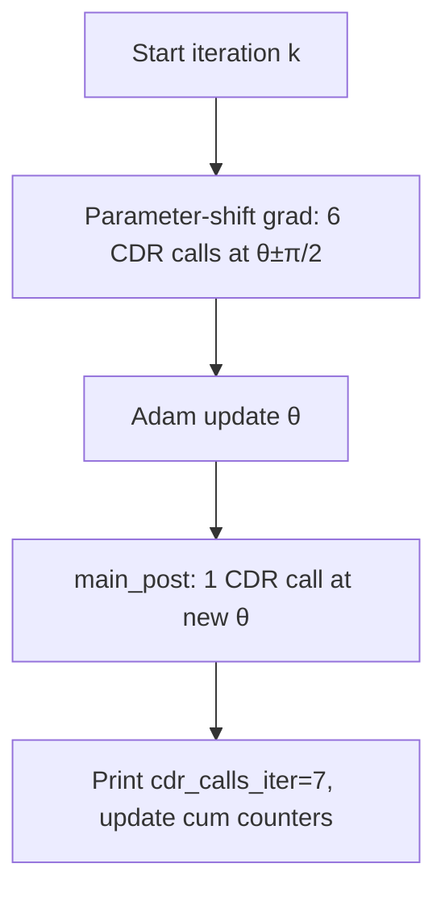

# VQE measurement cost (LiH fig13)

This document explains how the **measurement-cost counters** printed during the VQE loop in [`test_LiH_case/lih_fig13_compiled_ansatz.ipynb`](../test_LiH_case/lih_fig13_compiled_ansatz.ipynb) are defined and how to turn a log line into numbers. It uses the run that starts from

```text
[VQE] initial params (θ1, θ2, θ3) = [-0.07962120427073915, 0.4258693448167037, -0.2261300121017179]
```

with fixed `VQE_LR = 0.03` and `VQE_ITERS = 15`.

For what happens **inside** one CDR call (training circuits, per-Pauli fits, OGM shot allocation), see [`full_CDR_details_for_LiH_testing_case.md`](full_CDR_details_for_LiH_testing_case.md) and [`OGM_measure_procedure.md`](OGM_measure_procedure.md).

---

## 1. Fixed cost model (printed once at startup)

The notebook prints a **per-call** model before the main loop:

```text
[VQE] Cost model per CDR objective call: energy-evals=4 (num_circuits=3 + 1), shots/eval=4096, shots/call=16384
```

| Symbol (notebook) | Value | Meaning |
|-------------------|-------|---------|
| `_num_circuits` | `3` | CDR training circuits (`CDR_NUM_TRAINING_CIRCUITS`) |
| `_energy_evals_per_cdr_call` | `4` | `num_circuits + 1` shot-energy evaluations inside one outer CDR objective |
| `_num_shots` | `4096` | Shots per inner energy evaluation (OGM budget per eval) |
| `_shots_per_cdr_call` | `16384` | `_energy_evals_per_cdr_call × _num_shots` |

**Formulas:**

```text
energy_evals_per_call = num_circuits + 1
shots_per_call        = energy_evals_per_call × shots_per_eval
```

The `+ 1` is one **target** energy evaluation at the current VQE parameters (on top of the `num_circuits` training evaluations used to fit CDR). The notebook comment notes that a full per-Pauli CDR path can use more internal baselines; for **this** LiH fig13 configuration the logged accounting uses `num_circuits + 1 = 4`.

---

## 2. What counts as one `cdr_call`?

The global counter `_n_energy_total` increments by **1** on every outer call that runs finite-shot CDR mitigation at some parameter vector θ:

- `_vqe_energy(θ, bucket)` → one `energy_from_params(..., energy_mode="cdr_rem_corrected")`
- `_vqe_run_mitigation_triple(θ, bucket)` → one `run_mitigation("cdr", ...)` (returns raw / REM / CDR energies, but still **one** counted call)

**Not counted:** exact noiseless energies (`_vqe_noiseless`, used only for the decoupled reference curve).

Buckets used in this run:

| Bucket | When | Calls in full run |
|--------|------|-------------------|
| `init` | Once before iter 1 | 1 |
| `main_grad` | Parameter-shift gradient (6 per main iter) | 90 (= 6 × 15) |
| `main_post` | Energy after Adam step (1 per main iter) | 15 |
| `final` | Once after iter 15 | 1 |
| **Total** | | **107** |

---

## 3. Log field definitions

Each main-loop line looks like:

```text
[VQE] iter=01  lr=0.03  E=-7.84884825  dE=-6.456e-02  step_max=3.000e-02  step_l2=5.196e-02  active=[0, 1, 2]  cdr_calls_iter=7  cdr_calls_cum=8  energy_evals_cum≈32  shots_cum≈131072
```

| Field | Definition |
|-------|------------|
| `iter` | Main optimization iteration `it` (1 … 15) |
| `E` | CDR+REM corrected energy at **updated** θ after the Adam step (`main_post`) |
| `dE` | `E` minus previous iteration’s `E` |
| `cdr_calls_iter` | CDR calls **during this iteration only**: `_n_energy_total - _count_before` at start of loop body |
| `cdr_calls_cum` | Running total `_n_energy_total` **after** this iteration |
| `energy_evals_cum` | `cdr_calls_cum × energy_evals_per_call` (= `× 4`) |
| `shots_cum` | `cdr_calls_cum × shots_per_call` (= `× 16384`) |

**Why `cdr_calls_iter` is always 7:** For 3 parameters, parameter-shift uses 2 evaluations per coordinate (θᵢ ± π/2), so 6× `_vqe_energy(..., "main_grad")`, plus 1× `_vqe_run_mitigation_triple(..., "main_post")` after the Adam update.



---

## 4. Worked examples: iterations 1, 2, and 3

### Before iteration 1 (baseline, not on iter lines)

One `init` call runs at θ₀ before the loop. That call is included in **`cdr_calls_cum` at iter=01** but not in `cdr_calls_iter` for iter=01.

```text
cdr_calls before iter 1 ends  = 1 (init)
```

### Iteration 1

**Log:**

```text
cdr_calls_iter=7  cdr_calls_cum=8  energy_evals_cum≈32  shots_cum≈131072
```

**Step-by-step:**

| Step | CDR calls this step | Running `cdr_calls_cum` |
|------|---------------------|-------------------------|
| Start of iter 1 | — | 1 (from `init`) |
| Parameter-shift (6 energies) | +6 | 7 |
| `main_post` at new θ | +1 | **8** |

So `cdr_calls_iter = 8 − 1 = 7`.

**Derived totals at end of iter 1:**

```text
energy_evals_cum = 8 × 4        = 32
shots_cum        = 8 × 16384    = 131072
```

### Iteration 2

**Log:**

```text
cdr_calls_iter=7  cdr_calls_cum=15  energy_evals_cum≈60  shots_cum≈245760
```

**Arithmetic:**

```text
cdr_calls_cum(2) = 8 + 7 = 15
energy_evals_cum = 15 × 4     = 60
shots_cum        = 15 × 16384 = 245760
```

**Increment vs iter 1:** `+7` calls, `+28` energy evals, `+114688` shots.

### Iteration 3

**Log:**

```text
cdr_calls_iter=7  cdr_calls_cum=22  energy_evals_cum≈88  shots_cum≈360448
```

**Arithmetic:**

```text
cdr_calls_cum(3) = 15 + 7 = 22
energy_evals_cum = 22 × 4     = 88
shots_cum        = 22 × 16384 = 360448
```

**Increment vs iter 2:** again `+7`, `+28`, `+114688`.

---

## 5. General formulas (main-loop print lines)

Let `k` be the iteration index on the log line (`iter=01` → `k=1`, …, `iter=15` → `k=15`).

**Cumulative CDR calls after iteration `k`:**

```text
cdr_calls_cum(k) = 1 + 7k
```

(`1` = `init`; each main iteration adds `7`.)

**Cumulative energy evaluations and shots:**

```text
energy_evals_cum(k) = cdr_calls_cum(k) × 4
shots_cum(k)        = cdr_calls_cum(k) × 16384
```

**Per-iteration increment (for k ≥ 1):**

```text
Δcdr_calls_iter     = 7
Δenergy_evals_cum   = 28
Δshots_cum          = 114688
```

Example check at `k=15`:

```text
cdr_calls_cum(15) = 1 + 7×15 = 106
energy_evals_cum  = 106 × 4 = 424
shots_cum         = 106 × 16384 = 1736704
```

This matches the printed iter=15 line.

---

## 6. Final total: why 107 calls, not 106

After the main loop finishes, the notebook runs **one more** CDR call that is **not** included in any `iter=..` line:

```python
_, _, E_final = _vqe_run_mitigation_triple(theta, "final")
```

So the last printed iteration still shows `cdr_calls_cum=106`, but the **TOTAL** line counts the extra `final` call:

```text
[VQE] TOTAL measurement cost: cdr_calls=107, energy_evals≈428, total_shots≈1753088
```

**Reconciliation:**

```text
total_cdr_calls   = 106 + 1 (final) = 107
total_energy_evals = 107 × 4      = 428
total_shots        = 107 × 16384  = 1753088
```

Full breakdown:

| Phase | CDR calls |
|-------|-----------|
| `init` | 1 |
| Main loop (15 × 7) | 105 |
| `final` | 1 |
| **Total** | **107** |

---

## 7. Quick sanity checks

When reading a new log from the same notebook settings:

1. **`cdr_calls_iter`** should be `2 × P + 1` with `P=3` parameters → **7**.
2. **`cdr_calls_cum` at iter k** should be **`1 + 7k`**.
3. **`energy_evals_cum`** = **`cdr_calls_cum × 4`**; **`shots_cum`** = **`cdr_calls_cum × 16384`**.
4. **TOTAL `cdr_calls`** = last iter’s `cdr_calls_cum` **+ 1** (the `final` evaluation).

If you change `CDR_NUM_TRAINING_CIRCUITS`, `num_shots`, or `P`, update the per-call model and the `2P+1` rule accordingly.

---

## 8. Reference: notebook code that defines the counters

From [`lih_fig13_compiled_ansatz.ipynb`](../test_LiH_case/lih_fig13_compiled_ansatz.ipynb):

```python
_energy_evals_per_cdr_call = int(_num_circuits + 1)
_shots_per_cdr_call = int(_energy_evals_per_cdr_call * _num_shots)

# Inside main loop, after iteration body:
cdr_calls_this_iter = int(_n_energy_total - _count_before)
cum_cdr_calls = int(_n_energy_total)
cum_energy_evals = int(cum_cdr_calls * _energy_evals_per_cdr_call)
cum_shots = int(cum_cdr_calls * _shots_per_cdr_call)

# After loop:
_total_cdr_calls = int(_n_energy_total)
_total_energy_evals = int(_total_cdr_calls * _energy_evals_per_cdr_call)
_total_shots = int(_total_cdr_calls * _shots_per_cdr_call)
```

Parameter-shift gradient (6 counted calls per iteration):

```python
for i in range(3):
  g[i] = 0.5 * (_vqe_energy(pp, bucket) - _vqe_energy(pm, bucket))
```
