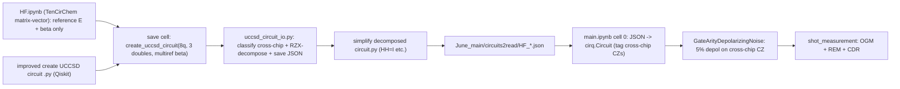

# General noisy UCCSD simulation pipeline

Overview: Turn `June_main/main.ipynb` into a general molecule-agnostic noisy-VQE notebook that loads cross-chip-aware UCCSD circuits saved by the molecule notebooks (default: HF, 8 qubits, top-3 doubles), with higher depolarizing noise on cross-chip CZs.

Key fact (confirmed by user): the circuit is ALWAYS built by `UCCSD circuit/improved create UCCSD circuit .py` (`create_uccsd_circuit`). `UCCSD_Mole/HF.ipynb` is pure matrix-vector (TenCirChem) work and holds NO circuit info; it only supplies reference energies and the optimized multireference `beta`. So there is no TenCirChem->circuit ordering issue.

Defaults chosen (adjustable):
- Save format: custom JSON gate-list with a `cross_chip` flag per 2-qubit gate.
- Cross-chip rule: chips = 2 spatial orbitals (4 qubits: 2 up + 2 down). `chip(q) = (q % (N//2)) // 2`. A CZ is cross-chip when its two qubits sit in different chips (matches the dashed 2x2 boxes in the sketch).
- End-to-end scope: HF -> 8 qubits (`half=4`, `n_electrons=6`, `eta=3`). Default "three doubles" in the generator's paper layout = `[(7,3,4,0), (7,3,5,1), (7,3,6,2)]`, i.e. `(7, 3, k+4, k)` for `k in range(3)` (the HF analog of the generator's F2 demo `(11, 5, k+6, k)`). Helper code kept molecule-agnostic so F2/Cl2/Br2 only need their own save snippet later.

## Data flow

## 1. Circuit save + cross-chip decomposition (molecule notebooks)

- New module `UCCSD circuit/uccsd_circuit_io.py` (importable; loads the space-named generator via `importlib`):
  - `chip_of(q, n)` and `is_cross_chip(a, b, n)` implementing the chip rule above.
  - `decompose_cross_chip_cz(control, target)` -> the requested native form `CZ = (Rz_c(-pi/2) (x) H Rx_t(-pi/2)) . RZX(pi/2) . (I (x) H)`. Because CZ is symmetric, try BOTH control/target orientations and pick whichever maximizes cancellation against neighboring gates -- the cancellation can be an `H`-`H`=I OR a single-qubit rotation merge/cancel (e.g. adjacent `Rz`/`Rx` that combine to identity or fold into a neighbor).
  - `save_circuit_json(qc, path, ...)`: walk the Qiskit circuit, emit `{"num_qubits", "n_spatial", "doubles", "params": [...], "gates": [{op, qubits, param, cross_chip}]}`. Cross-chip CZs are stored in decomposed RZX form with `cross_chip=true`; everything else stays logical.
- `UCCSD_Mole/HF.ipynb`'s ONLY job for the circuit is to choose which doubles to use (the `[(7,3,4,0),(7,3,5,1),(7,3,6,2)]` set found there); the circuit itself is built by the generator. Append a final cell that does NOT touch TenCirChem `ex_ops` and calls `create_uccsd_circuit(num_qubits=8, doubles=<chosen doubles>, n_electrons=6, init_state='multiref', beta=<beta from cell 2>)`, then `decompose cross-chip CZ + save_circuit_json(...)` to `June_main/circuits2read/HF_bond_<d>.json`. The existing `configure_ucc_initial_state(..., optimize_beta=True)` output feeds the circuit's multireference prep so the saved circuit matches HF.ipynb's reference state.

## 2. Simplifier

- New file `UCCSD circuit/simplify decomposed circuit.py` (name per request): input = the saved JSON; maximizes gate cancellation of BOTH kinds -- adjacent `H H = I` AND single-qubit rotation merges/cancellations (combine consecutive `Rz`/`Rx` on a qubit, drop those that fold to identity). Rewrites a simplified JSON next to the input (`*_simplified.json`). Reuses the CZ-commuting peephole idea from the generator's `_peephole`.

## 3. Generalized helper modules (copy + edit from test_LiH_case)

- `June_main/main_cursor_lib.py` (copy of `test_LiH_case/main_cursor_lib_test_LiH.py`):
  - Extend `GateArityDepolarizingNoise` with `cross_chip_two_qubit_depol_prob` (default `0.05`): in `noisy_operation`, a 2-qubit op carrying the cross-chip tag (or whose qubit pair is cross-chip) gets the higher prob; others keep `0.018`. Mirrors the tag logic in `UNUSED classical reversoir material/main_cursor_lib.py` lines 33-48.
  - Generalize CDR symbol handling (`_is_symbol_theta`/`clifford_snap_value_for_symbol`) so generic UCCSD `RX(t_k)` angles are treated as theta-like.
- `June_main/shot_measurement.py` (copy of `test_LiH_case/shot_measurement_test_LiH.py`): only import/path edits; OGM defaults to `June_main/OGM_measurement_basis/OGM_<MOL>_bond_<d>.txt`. The notebook already imports `shot_measurement` as a fallback.

## 4. Generalize main.ipynb

- Cell 0: replace hardcoded `lih_fig13_circuit` with a JSON->`cirq.Circuit` loader on `LineQubit.range(N)` that tags cross-chip CZs (e.g. `.with_tags("cz_high")`); create sympy symbols `t0..t_{m-1}` from the JSON; set `MOLECULE="HF"`, `bond_length`, `N_QUBITS=8`.
- Cell 1: Hamiltonian path -> `Pauli_Ham/HF_bond_<d>.txt` (loader already generic).
- Cells 2-15: replace every `theta1/theta2/theta3` and the fixed-3 reshapes with a length-`m` parameter vector and `dict(zip(symbols, params))`; point OGM to `June_main/OGM_measurement_basis`; switch imports to `main_cursor_lib` / `shot_measurement`; pass `cross_chip_two_qubit_depol_prob` into the noise model.

## Notes / risks (verified)

- Confirmed `reshape(3)` / `theta1..3` / `symbols_li_h` are hardcoded in `main.ipynb` cells 0,1,3,4,7,10,11,13,14 -> all become length-`m` (`m=3` for HF default, but driven by the JSON).
- Confirmed `HF_bond_*.txt` Hamiltonians (8 Pauli codes/line = 8 qubits) and `OGM_HF_bond_*.txt` exist; the LiH OGM pipeline already consumes this shadowgrouping format, so only the path/molecule name changes.
- With only 1 virtual orbital per spin sector, the 3 HF doubles share the same virtual pair `(7,3)`, so hub-continuity in the generator should yield a compact CZ count; the saved circuit's actual cross-chip CZ count should be sanity-checked once generated.
- The generator returns `(qc, strings, signs, theta_idx)`; the JSON must persist `theta_idx`/`signs` so `main.ipynb` can map the `m` sympy symbols onto the RX angles (with `pair=False` default, one RX per double).
